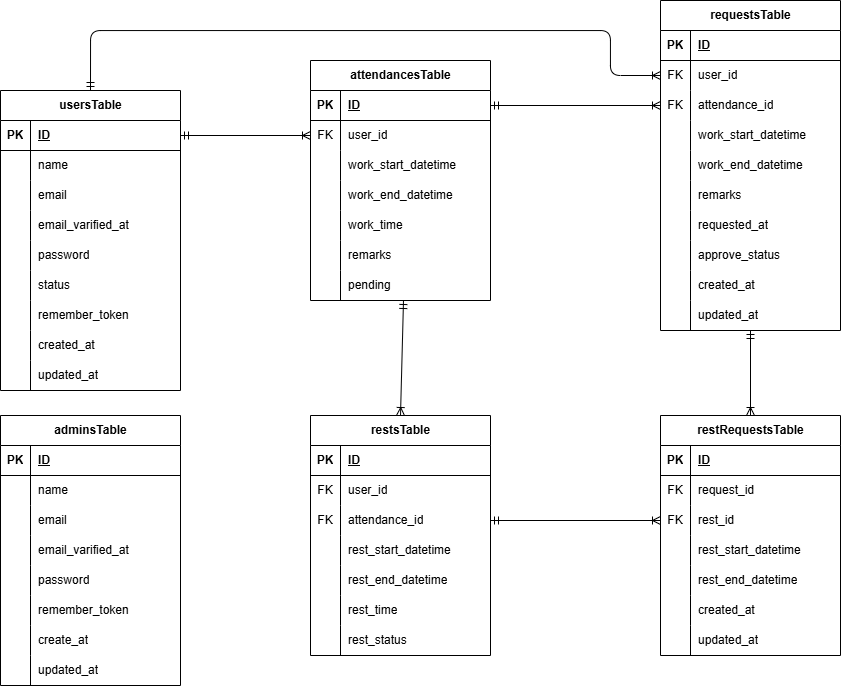

# Attendance-Manegement_app（勤怠アプリ）

##　環境構築
**Dockerビルド**
1. `git clone git@github.com:onodera-j/attendance-magegement.git`
2. DockerDesktopアプリを立ち上げる
3. `docker-compose up -d --build`

> *MacのM1・M2チップのPCの場合、`no matching manifest for linux/arm64/v8 in the manifest list entries`のメッセージが表示されビルドができないことがあります。
エラーが発生する場合は、docker-compose.ymlファイルの「mysql」内に「platform」の項目を追加で記載してください*
``` bash
mysql:
    platform: linux/x86_64(この文追加)
    image: mysql:8.0.26
    environment:
      MYSQL_ROOT_PASSWORD: root
      MYSQL_DATABASE: laravel_db
      MYSQL_USER: laravel_user
      MYSQL_PASSWORD: laravel_pass
```

**Laravel環境構築**
1. `docker-compose exec php bash`
2. `composer install`
3. 「.env.example」ファイルを 「.env」ファイルに命名を変更。または、新しく.envファイルを作成
4. .envに以下の環境変数を追加
``` text
DB_CONNECTION=mysql
DB_HOST=mysql
DB_PORT=3306
DB_DATABASE=laravel_db
DB_USERNAME=laravel_user
DB_PASSWORD=laravel_pass
```

5. アプリケーションキーの作成
``` bash
php artisan key:generate
```

6. マイグレーションの実行
``` bash
php artisan migrate
```

7. シーディングの実行
``` bash
php artisan db:seed
```
以下のデータを作成します
``` text
管理者アカウント
一般ログイン用アカウント
サンプルデータとして6人分の先月から昨日までの勤怠情報（月～金）
```

## ログイン
トップページ（一般・管理者ログイン選択）
```bash
http://localhost/
```
一般ユーザーログイン
```bash
http://localhost/login
```
管理者ログイン
```bash
http://localhost/admin/login/
```

## 管理者用アカウント
``` text
name: 管理者
email: admin@example.com
password: 00000000
```

## 一般アカウント
``` text
name: 一般ログイン
email: test@example.com
password: 00000000
```

## PHPUnitを利用したテストに関して
以下のコマンド:  
```
//テスト用データベースの作成
docker-compose exec mysql bash
mysql -u root -p
//パスワードはrootと入力
create database test_database;

docker-compose exec php bash
php artisan migrate:fresh --env=testing
テストの実行
vendor/bin/phpunit
```

## 使用技術(実行環境)
- PHP8.3.0
- Laravel8.83.8
- MySQL8.0.26

## ER図


## URL
- 開発環境：http://localhost/
- phpMyAdmin：http://localhost:8080/
- Mailhog：http://localhost:8025/
